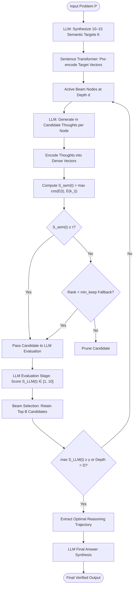

# Optimization of Tree of Thoughts Using Semantic Similarity (OTOTUSS)

[](https://www.python.org/downloads/)
[](https://opensource.org/licenses/MIT)
[](https://github.com/confident-ai/deepeval)
[](https://www.sbert.net/)

An empirical research framework for inference-time optimization of the Tree-of-Thoughts ([ToT](#ref-1)) paradigm using semantic similarity filtering. OTOTUSS introduces a lightweight embedding gate between thought generation and expensive Large Language Model (LLM) evaluations, substantially lowering inference latency and token overhead while preserving multi-path reasoning and solution quality.

---

## Table of Contents

- [Introduction](#introduction)
- [Related Work & Literature Review](#related-work--literature-review)
- [Proposed Methodology](#proposed-methodology)
  - [Algorithmic Architecture](#algorithmic-architecture)
  - [Search Workflow](#search-workflow)
  - [Motivation & Design Philosophy](#motivation--design-philosophy)
  - [Comparison with SSDP](#comparison-with-ssdp)
- [Experimental Setup](#experimental-setup)
- [Empirical Results](#empirical-results)
  - [Threshold Optimization (Grid Search)](#1-threshold-optimization-grid-search)
  - [Creative Text Generation](#2-creative-text-generation-qwen38b-judge)
  - [Logical Reasoning Benchmarks](#3-logical-reasoning-benchmarks-gsm8k--boolq)
  - [Key Findings & Claims Verification](#4-key-findings--claims-verification)
- [Repository Structure](#repository-structure)
- [Installation & Quick Start](#installation--quick-start)
- [Future Work](#future-work)
- [References](#references)

---

## Introduction

When presented with a prompt, a standard Large Language Model (LLM) typically generates a solution in a single direct decoding pass. While effective for simple retrieval or conversational queries, this mode struggles on problems demanding multi-step planning, mathematical deduction, or alternative hypothesis testing. **Chain-of-Thought (CoT)** prompting ([Wei et al., 2022](#ref-2)) introduced intermediate reasoning decomposition, significantly boosting complex problem solving. However, standard CoT commits greedily to a single reasoning trajectory, leaving it prone to early cascading errors and unable to explore alternative paths.

**Tree-of-Thoughts (ToT)** ([Yao et al., 2023](#ref-1)) formulated reasoning as tree search, enabling models to generate candidate intermediate thoughts, evaluate path value via LLMs, and backtrack across promising alternatives. While effective on combinatorial puzzles and deliberate planning, ToT introduces severe computational penalties: generating $m$ thoughts across depth $D$ with beam width $B$ requires up to $D \cdot B \cdot m$ full LLM candidate evaluations, drastically inflating token usage and execution latency.

Subsequent approaches such as **Graph-of-Thoughts (GoT)** and **Self-Consistency** ([Wang et al., 2023](#ref-3)) extended multi-path reasoning structures. Nevertheless, ToT offers a rigorous search formulation where the trade-off between reasoning quality and computational cost can be directly measured. Rather than introducing complex training schemes or non-standard graph topologies, this project introduces **OTOTUSS** (*Optimization of Tree of Thoughts Using Semantic Similarity*): an inference-time optimization designed to retain the exploratory advantages of tree search while drastically cutting token and runtime overhead through semantic similarity gating.

---

## Related Work & Literature Review

Existing literature addresses ToT efficiency from several orthogonal angles:

- **Value Estimation via MCTS**: Salahi et al. ([2024](#ref-4)) combined ToT with Monte Carlo Tree Search (MCTS) and a separately trained value model. Their findings confirmed that ToT efficiency is dominated by how candidate thoughts are generated and evaluated rather than the tree traversal algorithm alone.
- **Parallel Scheduling and Memory Caching**: *Dynamic Parallel Tree Search (DPTS)* ([Ding et al., 2025](#ref-5)) targeted execution bottlenecks, path-switching delays, and redundant node expansion. DPTS introduced dynamic worker parallelism and state cache management, achieving a $2\text{--}4\times$ throughput speedup without sacrificing task accuracy.
- **Policy-Guided Heuristic Search**: Pendurkar & Sharon ([2025](#ref-6)) adapted Levin Tree Search to ToT by leveraging language model token probabilities as search heuristics, prioritizing candidate expansion under tight evaluation budgets.
- **Redundancy-Based Node Pruning**: *Chopping Trees: Semantic Similarity Based Dynamic Pruning (SSDP)* ([Kim et al., 2025](#ref-7)) introduced dynamic pruning and branch merging based on pairwise thought-to-thought cosine similarity, showing substantial node count reductions across algorithmic benchmarks.
- **Branching Frequency Regulation**: *Chain-in-Tree (CiT)* ([Li, 2026](#ref-8)) proposed a lightweight "Branching Necessity" classifier that dynamically switches between linear CoT and tree branching, expanding nodes only when sequential generation encounters high uncertainty.
- **Reinforcement Learning Training**: *ToTRL* ([Wu et al., 2025](#ref-9)) explored offline model fine-tuning using reinforcement learning on puzzle benchmarks, training the model to internalize multi-path exploration rather than relying purely on external tree-search orchestrators.

| Method | Core Strategy | Target Bottleneck | Gating / Selection Mechanism |
| :--- | :--- | :--- | :--- |
| **MCTS-ToT** ([Salahi et al., 2024](#ref-4)) | Monte Carlo Tree Search + Value Model | Inaccurate node evaluation | Value network scoring |
| **DPTS** ([Ding et al., 2025](#ref-5)) | Parallel execution & caching | Memory & latency bottlenecks | Dynamic worker scheduling |
| **Policy ToT** ([Pendurkar & Sharon, 2025](#ref-6)) | Levin Tree Search heuristics | Query budget limits | LM generation log-probabilities |
| **SSDP** ([Kim et al., 2025](#ref-7)) | Pairwise branch merging | Sibling thought redundancy | Thought-to-thought cosine similarity |
| **CiT** ([Li, 2026](#ref-8)) | Selective branching | Unnecessary tree expansion | Branching necessity gating |
| **ToTRL** ([Wu et al., 2025](#ref-9)) | Reinforcement learning | Inference-time search dependency | Offline policy optimization |
| **OTOTUSS** (Ours) | Problem-anchored semantic gating | Excessive candidate evaluations | Problem-to-thought embedding similarity |

---

## Proposed Methodology

### Algorithmic Architecture

OTOTUSS is an inference-time optimization for tree-based reasoning that eliminates unpromising candidates prior to expensive LLM prompt evaluations:

1. **Dynamic Semantic Target Generation**: Given input problem $P$, an LLM prompt synthesizes a set $K = \{k_1, k_2, \ldots, k_q\}$ of $q \in [10, 15]$ semantic targets capturing core problem concepts and qualitative solution requirements (e.g., *sound deduction*, *feasibility*, *domain constraints*).
2. **Dense Vector Mapping**: A lightweight sentence encoder $E(\cdot)$ (such as `all-MiniLM-L6-v2`) pre-computes target vectors $\{E(k_i)\}_{i=1}^q$.
3. **Candidate Expansion & Semantic Scoring**: At each depth $d \le D$, $m$ candidate thoughts are generated per active path. For candidate thought $t$, its problem-level semantic relevance $S_{\mathrm{sem}}(t)$ is determined by the maximum cosine similarity across all targets:
   $$S_{\mathrm{sem}}(t) = \max_{k_i \in K} \frac{E(t)^\top E(k_i)}{\|E(t)\|_2 \|E(k_i)\|_2}$$
4. **Adaptive Semantic Gating & Fallback**: A candidate qualifies for LLM evaluation only if $S_{\mathrm{sem}}(t) \ge \tau$. If fewer than $k_{\min}$ (`min_keep`) candidates meet $\tau$, the top $k_{\min}$ candidates by semantic score are retained, preventing catastrophic path collapse.
5. **Contextual Evaluation & Beam Search**: Qualifying candidates are scored by the LLM in full reasoning context ($S_{\mathrm{LLM}}(t) \in [1, 10]$). The top $B$ candidates form the active set for depth $d+1$:
   $$A_d = \operatorname{TopB}\left(\{t : S_{\mathrm{sem}}(t) \ge \tau \lor t \in \text{Fallback}\}, S_{\mathrm{LLM}}\right)$$
6. **Early Termination & Synthesis**: If $\max_{t \in A_d} S_{\mathrm{LLM}}(t) \ge \gamma$, search terminates early. The highest-scoring path is reconstructed and passed to the LLM for final answer synthesis.

The theoretical evaluation reduction $R_{\mathrm{eval}}$ over standard ToT is:
$$R_{\mathrm{eval}} = 1 - \frac{\sum_{d=1}^D r_d}{D \cdot B \cdot m}$$
where $r_d$ denotes the count of candidates surviving the semantic gate at depth $d$.

### Search Workflow



### Motivation & Design Philosophy

As reasoning branches deepen, generative models often drift into the local context of adjacent thoughts, losing alignment with the global problem constraints. OTOTUSS counters this drift by anchoring candidates to dynamically generated problem keywords. Because embedding evaluation is computationally negligible compared to autoregressive generation, semantic gating eliminates unviable trajectories upfront, safeguarding the exploratory nature of tree search while curtailing token and latency explosion.

### Comparison with SSDP

| Dimension | Semantic Similarity-Based Dynamic Pruning (SSDP, [Kim et al., 2025](#ref-7)) | OTOTUSS (Ours) |
| :--- | :--- | :--- |
| **Comparison Axis** | Thought-to-Thought (Sibling redundancy) | Problem-to-Thought (Goal alignment) |
| **Pruning Goal** | Eliminate semantically duplicate branches | Eliminate off-target or irrelevant candidates |
| **Search Framework** | MCTS with UCB selection & branch merging | Beam Search ($B=2$) with early termination ($\gamma$) |
| **Embedding Target** | Sibling candidate thoughts | Problem-specific targets $K = \{k_1, \ldots, k_q\}$ |
| **Safety Net** | Dynamic clustering threshold | Rank-based fallback preservation (`min_keep`) |

---

## Experimental Setup

Experiments were executed across standard reasoning and generative tasks under strict reproducibility controls:

- **Target Reasoning Engine**: `Qwen2.5:7B` via Ollama (`temperature=0.7`, fixed random seeds `41, 42, 43`).
- **Evaluation Judge**: `Qwen3:8B` evaluated via DeepEval ([DeepEval, 2026](#ref-12)) and G-Eval ([Liu et al., 2023](#ref-11); [Zheng et al., 2023](#ref-10)) using customized criteria for answer relevancy, creativity, coherence, emotional depth, and writing quality.
- **Embedding Backbone**: `all-MiniLM-L6-v2` (`sentence-transformers>=5.6.1`).
- **Compared Baselines**:
  1. *Base Model*: Direct zero-shot generation.
  2. *Chain-of-Thought (CoT)*: Single-trajectory intermediate step prompting ([Wei et al., 2022](#ref-2)).
  3. *Tree-of-Thoughts (ToT)*: Breadth-first beam search ($B=2, m=4, D=3$) ([Yao et al., 2023](#ref-1)).
  4. *SSDP*: Dynamic branch pruning via sibling similarity ([Kim et al., 2025](#ref-7)).
- **Evaluation Benchmarks**:
  - **GSM8K** ([Cobbe et al., 2021](#ref-13)): 100 grade-school math word problems ($N_{\mathrm{shots}}=0$).
  - **BoolQ**: 100 complex boolean reading comprehension questions ($N_{\mathrm{shots}}=0$).
  - **Creative Generation**: 3 diverse prompts spanning emotional poetry, micro-fiction, and tech marketing evaluated across 5 G-Eval dimensions ($[0, 1]$ scale).
- **Statistical Rigor**: All benchmarks were evaluated across three independent seeds (`41`, `42`, `43`). Data is reported as $\text{mean} \pm \text{standard deviation}$.

---

## Empirical Results

### 1. Threshold Optimization (Grid Search)

A grid search over 9 configurations evaluated combinations of $\tau \in \{0.2, 0.5, 0.8\}$ and $\gamma \in \{8.0, 9.0, 9.5\}$ across logical reasoning (GSM8K subset) and creative writing:

#### Logical Reasoning Tuning (GSM8K, 10 Problems)
| Semantic Threshold ($\tau$) | Termination Threshold ($\gamma$) | Accuracy (%) | Avg Time (s) | Avg Tokens | Total Tokens |
| :---: | :---: | :---: | :---: | :---: | :---: |
| **0.2** | **8.0** | **46.67 ± 5.77%** | **18.35 ± 1.19** | **2853.17 ± 559.62** | 28,531.67 ± 5,596.23 |
| 0.2 | 9.0 | 46.67 ± 15.28% | 37.22 ± 4.43 | 6403.40 ± 143.49 | 64,034.00 ± 1,434.91 |
| 0.2 | 9.5 | 33.33 ± 11.55% | 33.26 ± 3.21 | 6398.93 ± 122.51 | 63,989.33 ± 1,225.06 |
| 0.5 | 8.0 | 40.00% | 15.42 ± 1.01 | 2629.00 ± 307.91 | 26,290.00 ± 3,079.12 |
| 0.5 | 9.0 | 43.33 ± 5.77% | 32.25 ± 5.29 | 5626.30 ± 260.82 | 56,263.00 ± 2,608.22 |
| 0.5 | 9.5 | 33.33 ± 11.55% | 30.16 ± 3.58 | 5622.43 ± 293.67 | 56,224.33 ± 2,936.69 |
| 0.8 | 8.0 | 33.33 ± 15.28% | 12.90 ± 0.75 | 1534.10 ± 211.02 | 15,341.00 ± 2,110.24 |
| 0.8 | 9.0 | 43.33 ± 11.55% | 17.64 ± 1.71 | 2131.10 ± 89.96 | 21,311.00 ± 899.58 |
| 0.8 | 9.5 | 40.00 ± 17.32% | 17.85 ± 1.91 | 2118.67 ± 64.88 | 21,186.67 ± 648.79 |

#### Creative Generation Tuning (3 Prompts)
| Semantic Threshold ($\tau$) | Termination Threshold ($\gamma$) | Creative Score (%) | Avg Time (s) | Avg Tokens | Total Tokens |
| :---: | :---: | :---: | :---: | :---: | :---: |
| **0.2** | **8.0** | **96.69 ± 1.14%** | **35.36 ± 3.05** | **1557.67 ± 49.62** | 4,673.00 ± 148.84 |
| 0.2 | 9.0 | 95.78 ± 1.68% | 66.84 ± 6.51 | 5362.67 ± 465.00 | 16,088.00 ± 1,395.00 |
| 0.2 | 9.5 | 95.78 ± 1.68% | 74.54 ± 20.28 | 5362.67 ± 465.00 | 16,088.00 ± 1,395.00 |
| 0.5 | 8.0 | 95.13 ± 0.75% | 40.57 ± 9.41 | 1271.33 ± 124.10 | 3,814.00 ± 372.32 |
| 0.5 | 9.0 | 95.80 ± 1.36% | 64.02 ± 20.96 | 3176.00 ± 672.46 | 9,528.00 ± 2,017.39 |
| 0.5 | 9.5 | 95.80 ± 1.36% | 64.76 ± 22.63 | 3176.00 ± 672.46 | 9,528.00 ± 2,017.39 |
| 0.8 | 8.0 | 95.13 ± 0.75% | 42.04 ± 12.84 | 1122.00 ± 34.49 | 3,366.00 ± 103.46 |
| 0.8 | 9.0 | 95.13 ± 0.75% | 52.20 ± 9.77 | 2067.11 ± 38.25 | 6,201.33 ± 114.76 |
| 0.8 | 9.5 | 95.13 ± 0.75% | 48.08 ± 2.68 | 2067.11 ± 38.25 | 6,201.33 ± 114.76 |

**Selected Hyperparameters**: $(\tau=0.2, \gamma=8.0)$ was chosen as the optimal operating point. It achieved the highest creative rating ($96.69\%$) and peak tuning accuracy ($46.67\%$) while consuming less than half the execution time and tokens of higher termination threshold variants.

---

### 2. Creative Text Generation (`Qwen3:8B` Judge)

Comparing OTOTUSS against SSDP across three distinct tasks: Prompt 1 (*Emotional Poetry*), Prompt 2 (*Micro-Fiction*), and Prompt 3 (*Product Pitch*).

| Prompt ID | Method | Generation Time (s) | Tokens Used | Relevancy | Creativity | Coherence | Emotional Depth | Writing Quality |
| :---: | :--- | :---: | :---: | :---: | :---: | :---: | :---: | :---: |
| **1** | SSDP | 50.66 ± 8.66 | 3,902.00 ± 4,448.94 | 1.00 | 0.97 ± 0.06 | 0.97 ± 0.06 | 1.00 | 1.00 |
| **1** | **OTOTUSS** | **33.58 ± 2.68** | **1,507.67 ± 46.37** | **1.00** | **0.93 ± 0.06** | **1.00** | **0.90** | **1.00** |
| **2** | SSDP | 75.27 ± 5.03 | 13,401.33 ± 152.35 | 1.00 | 0.97 ± 0.06 | 0.90 ± 0.17 | 0.80 | 0.97 ± 0.06 |
| **2** | **OTOTUSS** | **31.38 ± 1.76** | **1,473.67 ± 124.75** | **1.00** | **0.97 ± 0.06** | **1.00** | **0.97 ± 0.06** | **0.97 ± 0.06** |
| **3** | SSDP | 75.03 ± 13.21 | 10,125.33 ± 4,004.52 | 1.00 | 0.87 ± 0.12 | 1.00 | 0.97 ± 0.06 | 1.00 |
| **3** | **OTOTUSS** | **48.08 ± 1.71** | **1,679.00 ± 32.92** | **1.00** | **0.97 ± 0.06** | **1.00** | **0.87 ± 0.12** | **1.00** |

- **Computational Efficiency**: OTOTUSS reduced generation latency across all prompts from $50.66\text{--}75.27\text{ s}$ down to $31.38\text{--}48.08\text{ s}$ ($35\%\text{--}58\%$ faster).
- **Token Reductions**: Token consumption plummeted from $3,902\text{--}13,401$ tokens down to $1,474\text{--}1,679$ tokens (an **$83\%\text{--}89\%$ reduction** on Prompts 2 and 3).
- **Quality Parity**: Relevancy remained at $1.00$, with Coherence consistently reaching $1.00$ and Writing Quality matching SSDP at $0.97\text{--}1.00$.

---

### 3. Logical Reasoning Benchmarks (GSM8K & BoolQ)

Evaluated across 100 test problems per benchmark with $N_{\mathrm{shots}}=0$ across 3 random seeds (`41`, `42`, `43`):

| Benchmark | Method | Accuracy (%) | Avg Time per Problem (s) | Avg Tokens per Problem |
| :--- | :--- | :---: | :---: | :---: |
| **GSM8K** | Base Model | 32.67 ± 1.53% | 1.10 ± 0.11 | 110.81 ± 0.04 |
| | CoT Model | **90.67 ± 2.89%** | 17.19 ± 0.58 | 743.36 ± 12.85 |
| | ToT Model | 30.00 ± 1.00% | 68.49 ± 17.61 | 38,091.20 ± 892.96 |
| | SSDP Model | 36.00 ± 3.00% | 27.14 ± 4.67 | 8,798.33 ± 281.78 |
| | **OTOTUSS Model** | 30.67 ± 4.51% | **12.77 ± 0.17** | **2,375.26 ± 266.54** |
| **BoolQ** | Base Model | 76.00% | 0.92 ± 0.11 | 181.72 ± 0.02 |
| | CoT Model | **82.00%** | 26.44 ± 14.14 | 1,004.92 ± 252.94 |
| | ToT Model | 80.33 ± 3.21% | 33.03 ± 4.88 | 19,783.83 ± 1,351.05 |
| | SSDP Model | 80.33 ± 3.51% | 14.51 ± 2.37 | 5,174.32 ± 259.62 |
| | **OTOTUSS Model** | **79.67 ± 2.08%** | **13.31 ± 0.33** | **2,922.89 ± 293.01** |

---

### 4. Key Findings & Claims Verification

1. **Massive Search Overhead Reduction**:
   - Compared to standard ToT, OTOTUSS reduced per-problem token consumption on GSM8K from $38,091.20$ to $2,375.26$ (**$\approx 93.8\%$ reduction**) and inference latency from $68.49\text{ s}$ to $12.77\text{ s}$ (**$5.3\times$ faster**).
   - Compared to SSDP, OTOTUSS reduced tokens on GSM8K from $8,798.33$ to $2,375.26$ (**$\approx 73.0\%$ reduction**) and latency from $27.14\text{ s}$ to $12.77\text{ s}$ (**$2.1\times$ faster**).
2. **Competitive Performance on Reading Comprehension**:
   - On BoolQ, OTOTUSS ($79.67 \pm 2.08\%$) achieved parity with both ToT ($80.33 \pm 3.21\%$) and SSDP ($80.33 \pm 3.51\%$) while cutting token usage by $85.2\%$ vs ToT and $43.5\%$ vs SSDP.
3. **Task-Dependent Reasoning Limits**:
   - On multi-step arithmetic (GSM8K), single-path linear Chain-of-Thought dominates with $90.67\%$ accuracy. Small 7B models evaluated on intermediate math steps can introduce cumulative errors or premature early-stopping. OTOTUSS is an **efficiency optimization of tree-based exploration**, not a replacement for specialized mathematical chain prompting.
4. **Superior Generative Resource Efficiency**:
   - In open-ended creative tasks, OTOTUSS produced outputs with near-perfect relevancy, coherence, and writing quality while requiring an order of magnitude fewer tokens than sibling-pruning baselines.

---

## Repository Structure

```text
├── README.md                          # Comprehensive research documentation
├── pyproject.toml                     # Python package & dependency specifications
├── download_datasets.py               # Pre-downloads GSM8K and BoolQ via DeepEval
├── main.py                            # Main benchmark runner across models
├── creative_writing_test.py           # Creative writing benchmark evaluator
├── tune_ototuss.py                    # Grid search hyperparameter tuning (GSM8K)
├── tune_ototuss_creative.py           # Grid search hyperparameter tuning (Creative)
├── aggregate_results.py               # Aggregates seed runs (41, 42, 43) into mean ± std
├── custom_metrics.py                  # DeepEval G-Eval metric definitions
├── extract_final_answer_test.py       # Answer parsing test suite
├── methods/
│   ├── base.py                        # Zero-shot Base LLM wrapper
│   ├── cot.py                         # Chain-of-Thought (CoT) wrapper
│   ├── tot.py                         # Standard Tree-of-Thoughts (BFS)
│   ├── ssdp.py                        # Semantic Similarity Dynamic Pruning baseline
│   └── ototuss.py                     # Proposed OTOTUSS implementation
└── results/
    ├── 41/, 42/, 43/                  # Raw output data per random seed
    └── final/                         # Aggregated statistical benchmarks (CSV)
```

---

## Installation & Quick Start

### Prerequisites
- Python $\ge 3.11$
- [Ollama](https://ollama.com/) running locally with models `qwen2.5:7b` and `qwen3:8b`:
  ```bash
  ollama pull qwen2.5:7b
  ollama pull qwen3:8b
  ```

### 1. Environment Setup

Using `pip` or `uv`:
```bash
git clone https://github.com/your-username/ototuss.git
cd ototuss

# Using uv
uv sync

# Or using pip in a virtual environment
python -m venv .venv
source .venv/bin/activate  # On Windows: .venv\Scripts\activate
pip install .
```

### 2. Prepare Datasets
Pre-cache evaluation splits locally:
```bash
python download_datasets.py
```

### 3. Run Benchmark Evaluations
Run the full comparative evaluation across Base, CoT, ToT, SSDP, and OTOTUSS on GSM8K and BoolQ:
```bash
python main.py
```

### 4. Evaluate Creative Generation
Run the LLM-as-a-Judge creative writing test suite:
```bash
python creative_writing_test.py
```

### 5. Reproduce Grid Search & Aggregation
```bash
# Run threshold parameter grid searches
python tune_ototuss.py
python tune_ototuss_creative.py

# Aggregate raw multi-seed runs into final statistics
python aggregate_results.py
```

---

## Future Work

1. **Systematic Component Ablation**: Conduct ablation trials isolating the exact empirical impact of each component: (a) problem target embedding similarity vs random keyword targets, (b) fallback retention thresholding (`min_keep`), and (c) early-termination thresholding ($\gamma$).
2. **Thought-Level Trajectory Instrumentation**: Instrument fine-grained counters across search iterations to log candidate generation volume, embedding rejection rates, fallback intervention frequency, and beam transition states.
3. **Step-Level Mathematical Verification**: Incorporate step-level math verification models ([Cobbe et al., 2021](#ref-13); [Lightman et al., 2024](#ref-14); [Weng et al., 2022](#ref-15)) into the scoring stage to close the accuracy gap on formal mathematical reasoning.

---

## References

- <a id="ref-1"></a>**[1]** S. Yao, D. Yu, J. Zhao, I. Shafran, T. L. Griffiths, Y. Cao, and K. R. Narasimhan, “Tree of Thoughts: Deliberate Problem Solving with Large Language Models,” in *Advances in Neural Information Processing Systems (NeurIPS)*, vol. 36, 2023, pp. 11809–11822. [arXiv:2305.10601](https://arxiv.org/abs/2305.10601)
- <a id="ref-2"></a>**[2]** J. Wei, X. Wang, D. Schuurmans, M. Bosma, F. Xia, E. Chi, Q. Le, and D. Zhou, “Chain-of-Thought Prompting Elicits Reasoning in Large Language Models,” in *Advances in Neural Information Processing Systems (NeurIPS)*, vol. 35, 2022. [arXiv:2201.11903](https://arxiv.org/abs/2201.11903)
- <a id="ref-3"></a>**[3]** X. Wang, J. Wei, D. Schuurmans, Q. Le, E. Chi, S. Narang, A. Chowdhery, and D. Zhou, “Self-Consistency Improves Chain of Thought Reasoning in Language Models,” in *International Conference on Learning Representations (ICLR)*, 2023. [arXiv:2203.11171](https://arxiv.org/abs/2203.11171)
- <a id="ref-4"></a>**[4]** K. Salahi, P. Gurusankar, and S. Edamadaka, “More Effectively Searching Trees of Thought for Increased Reasoning Ability in Large Language Models,” Stanford CS224N Custom Project Report, 2024.
- <a id="ref-5"></a>**[5]** Y. Ding, W. Jiang, S. Liu, Y. Jing, J. Guo, Y. Wang, J. Zhang, Z. Wang, Z. Liu, B. Du, X. Liu, and D. Tao, “Dynamic Parallel Tree Search for Efficient LLM Reasoning,” in *Proceedings of the 63rd Annual Meeting of the Association for Computational Linguistics (ACL)*, 2025, pp. 11233–11252.
- <a id="ref-6"></a>**[6]** S. Pendurkar and G. Sharon, “Policy-Guided Search on Tree-of-Thoughts for Efficient Problem Solving with Bounded Language Model Queries,” in *Transactions on Machine Learning Research (TMLR)*, 2025. [arXiv:2404.05581](https://arxiv.org/abs/2404.05581)
- <a id="ref-7"></a>**[7]** J. Kim, X. Huang, Z. Reza, G. Grand, K. Zhu, and R. Lagasse, “Chopping Trees: Semantic Similarity Based Dynamic Pruning for Tree-of-Thought Reasoning,” arXiv preprint [arXiv:2511.08595](https://arxiv.org/abs/2511.08595), 2025.
- <a id="ref-8"></a>**[8]** X. Li, “Chain-in-Tree: Back to Sequential Reasoning in LLM Tree Search,” in *Findings of the Association for Computational Linguistics: ACL 2026*, 2026, pp. 4365–4392.
- <a id="ref-9"></a>**[9]** H. Wu, X. Chen, R. Ming, J. Gao, S. Hu, Z. He, and B. Yu, “ToTRL: Unlock LLM Tree-of-Thoughts Reasoning Potential through Puzzles Solving,” arXiv preprint [arXiv:2505.12717](https://arxiv.org/abs/2505.12717), 2025.
- <a id="ref-10"></a>**[10]** L. Zheng, W.-L. Chiang, Y. Sheng, S. Zhuang, Z. Wu, Y. Zhuang, Z. Lin, Z. Li, E. P. Xing, H. Zhang, J. E. Gonzalez, and I. Stoica, “Judging LLM-as-a-Judge with MT-Bench and Chatbot Arena,” in *Advances in Neural Information Processing Systems (NeurIPS)*, 2023. [arXiv:2306.05685](https://arxiv.org/abs/2306.05685)
- <a id="ref-11"></a>**[11]** Y. Liu, D. Iter, Y. Xu, S. Wang, R. Xu, and C. Zhu, “G-Eval: NLG Evaluation using GPT-4 with Better Human Alignment,” in *Proceedings of the 2023 Conference on Empirical Methods in Natural Language Processing (EMNLP)*, 2023, pp. 2511–2522. [arXiv:2303.16634](https://arxiv.org/abs/2303.16634)
- <a id="ref-12"></a>**[12]** Confident AI, “DeepEval: The LLM Evaluation Framework,” 2026. [GitHub Repository](https://github.com/confident-ai/deepeval)
- <a id="ref-13"></a>**[13]** S. Cobbe, V. Kosaraju, M. Bavarian, M. Chen, H. Jun, L. Kaiser, M. Plappert, J. Tworek, J. Hilton, R. Nakano, C. Hesse, and J. Schulman, “Training Verifiers to Solve Math Word Problems,” arXiv preprint [arXiv:2110.14168](https://arxiv.org/abs/2110.14168), 2021.
- <a id="ref-14"></a>**[14]** J. Lightman, V. Kosaraju, Y. Burda, H. Edwards, B. Baker, T. Lee, J. Leike, J. Schulman, I. Sutskever, and K. Cobbe, “Let’s Verify Step by Step,” in *International Conference on Learning Representations (ICLR)*, 2024. [arXiv:2305.20050](https://arxiv.org/abs/2305.20050)
- <a id="ref-15"></a>**[15]** Y. Weng, M. Zhu, F. Xia, B. Li, S. He, S. Liu, B. Sun, K. Liu, and J. Zhao, “Large Language Models are Better Reasoners with Self-Verification,” arXiv preprint [arXiv:2212.09561](https://arxiv.org/abs/2212.09561), 2022.

